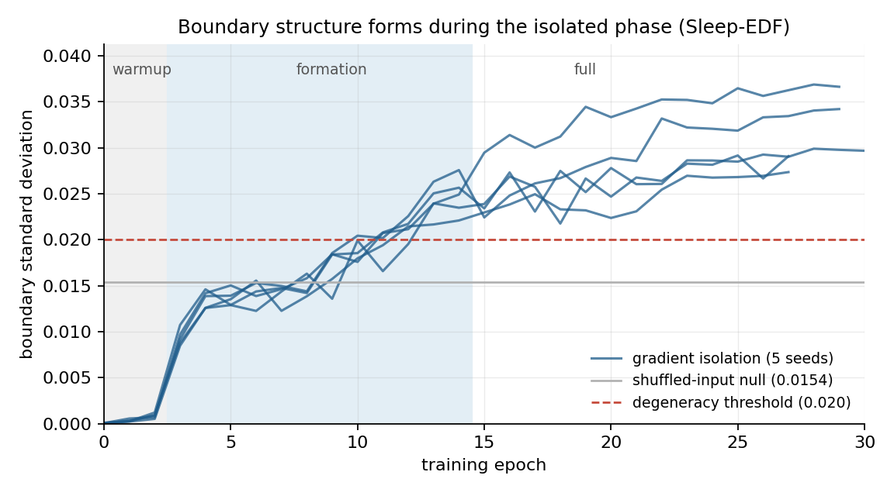
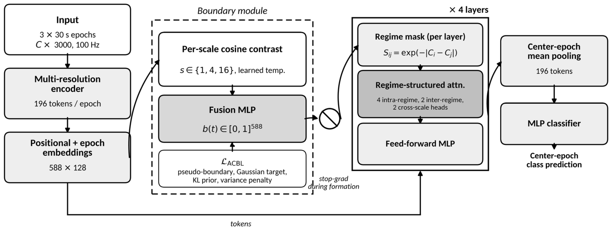
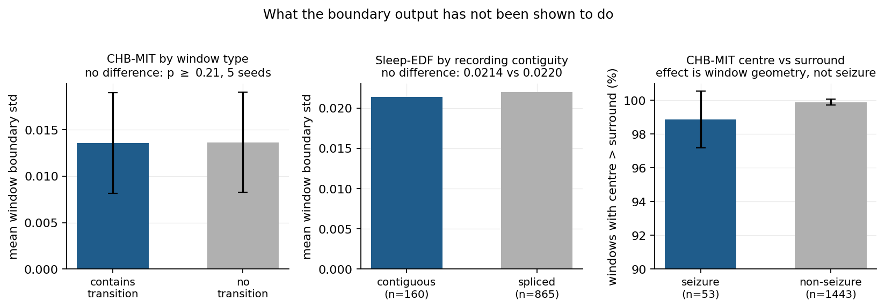

# NeuroState

**Gradient-Isolated Boundary Learning for Interpretable EEG Transformers**

Yogarajan Sivakumar, Hong Man · Department of Electrical and Computer
Engineering, Stevens Institute of Technology

Accepted at the **2026 IEEE International Workshop on Machine Learning for
Signal Processing (MLSP)**, Atlanta, 28 September to 1 October 2026.

---

## What this is about

EEG transformers classify accurately but say nothing about *when* a brain
state changes. Transition timing is clinically meaningful: seizure onset
latency informs intervention, and sleep-stage transition patterns inform
diagnosis. The obvious fix is to bolt an auxiliary head onto the model that
predicts changepoint probabilities and lets them condition attention.

That fix does not work, and the reason it fails turned out to be more
interesting than the architecture. **The auxiliary head collapses to a
near-constant output.** Across eleven controlled interventions spanning
masking variants, loss reformulations, aggressive scheduling, architectural
changes and entirely different boundary parameterisations, only one
intervention avoided it.

The cause is a *useful-when-flat* property of the regime mask. Boundary
probabilities enter attention through

```
C_i = Σ_{j≤i} b(j)          S_ij = exp(−|C_i − C_j|)
```

When `b(t)` is constant, `C` is linear in position and `S_ij` depends only on
`|i − j|`. The mask degenerates into an exponential distance-decay filter that
is *already a useful attention prior*, supporting above-0.70 accuracy on
Sleep-EDF on its own. The classifier gains almost nothing from an informative
boundary head, so the classification gradient never pushes the head to become
one.

The remedy is directional. During a formation phase, the boundary output is
detached on the path into attention while the auxiliary objective's own
gradient still reaches the head:

```python
b = boundary_head(h)
b_attn = isolate(b, active=schedule.detach_boundaries(epoch))  # stop-grad
logits = classifier(h, b_attn)
loss = cross_entropy(logits, y) + lam * acbl(b, ...)           # b, not b_attn
```

Detach both directions and the head is untrainable. Couple both and collapse
returns. **The asymmetry is the mechanism**, and because it is a property of
how gradients flow rather than of how boundaries are written down, it is not
tied to this particular boundary head. The collapse it addresses appears under
sigmoid masks, discrete masks, hidden Markov models and segmentation queries
alike, which is what points at the joint optimisation as the cause. Gradient
isolation itself was tested on the sigmoid parameterisation; it has not been
applied to the other three.

See the mechanism yourself, on CPU, with no dataset access:

```bash
pip install -e .
python demo/collapse_demo.py
```

<p align="center">
  
</p>

Boundary structure is absent during warmup, forms once ACBL activates under
isolation, and settles well above both the shuffled-input null and the 0.020
degeneracy threshold. Regenerate with `python scripts/make_figures.py`.

<p align="center">
  
</p>

Figure 1 of the paper. The circled stop-gradient symbol between the fusion MLP
and the regime mask is the intervention: during the formation phase the
classification gradient cannot cross it, while the ACBL losses still reach the
boundary module from below.

---

## Results

Five training seeds, fixed data split, mean ± sample standard deviation. Every
value is regenerated from `results/` by `scripts/make_tables.py`, not
transcribed.

| Dataset | Acc | AUROC | κ | Sens. | Bnd Std |
|---|---|---|---|---|---|
| Sleep-EDF (5-class staging) | 0.698 ± 0.013 | — | 0.596 ± 0.018 | — | 0.026 ± 0.003 |
| CHB-MIT (cross-subject seizure) | 0.901 ± 0.043 | 0.924 ± 0.014 | 0.356 ± 0.132 | 0.796 ± 0.047 | 0.014 ± 0.006 |
| TUAB (abnormality)<sup>†</sup> | 0.916 | 0.913 | 0.545 | 0.569 | 0.003 |

<sup>†</sup> Single seed. Its boundary figure is the pooled statistic reported
in the paper; the shipped result file records it per class instead (0.0023
abnormal, 0.0027 normal), so this one cell is not regenerable from
`results/` and is excluded from the provenance check. TUAB is a
**specificity control**, not a performance result: its labels apply
to whole recordings, so no window contains a within-window transition and a
flat boundary output is the correct response. Read
[`docs/reproducibility.md`](docs/reproducibility.md) before quoting it.

**On the Sleep-EDF accuracy.** It sits below published sleep stagers
(AttnSleep 0.829, L-SeqSleepNet 0.886). Two things separate the numbers beyond
architecture. The 3-epoch context window is deliberately short, chosen for
sub-epoch boundary resolution, while L-SeqSleepNet uses 200 epochs of context
with SHHS pretraining. And the preprocessing retained only annotations lasting
exactly one 30-second epoch, which leaves a subset dominated by short
transitional runs, the hardest epochs to classify. The accuracy gap is a
deliberate trade for an auxiliary boundary output that none of those
architectures produces.

**Collapse (Table 1, single seed, Sleep-EDF).** The 0.020 line labels a
degenerate boundary distribution; it is a descriptive cutoff calibrated
against the shuffled-input null, not a statistical test. The two alternative
parameterisations produce no comparable boundary statistic, so their
degeneracy rests on accuracy and on inspection of the learned outputs. The
ACBL rows are cumulative, not alternatives.

| Category | Intervention | Acc | Bnd Std |
|---|---|---|---|
| Masking | Sigmoid mask | 0.703 | 0.010 |
| | Gumbel-Softmax | 0.642 | 0.003 |
| | Hard threshold | 0.677 | 0.004 |
| ACBL loss | Boundary losses alone | 0.667 | 0.011 |
| | + variance penalty | 0.690 | 0.007 |
| | **+ gradient isolation** | **0.718** | **0.028** |
| Scheduling | Bimodal + extended formation | 0.626 | 0.014 |
| | Temperature anneal + focal | 0.666 | 0.006 |
| Architectural | Cumulative product masking | 0.678 | 0.018 |
| Alt. parameterisation | Differentiable HMM | 0.546 | n/a |
| | Query-based segmentation | 0.707 | n/a |

Full write-up of what each intervention tried and how it failed:
[`docs/collapse_experiments.md`](docs/collapse_experiments.md).

---

## What the evidence supports, and what it does not

The camera-ready reframes the paper around the optimisation contribution and
marks interpretability as preliminary. This section states where each claim
sits, because a reader should not have to reconstruct that from the tables.

### Supported

**Auxiliary head collapse is a real and robust failure mode.** Eleven
interventions, five categories, consistent degeneracy. Discretising the mask
does not change the dynamics. Aggressive scheduling finds new degenerate
solutions rather than escaping them. Cumulative-product masking collapses to
all-ones instead of all-zeros, so the masking operation sets the *direction*
while the pathology itself is invariant.

**Gradient isolation is the only intervention among the eleven that
produces a non-degenerate boundary head.** It is necessary, and the variance
penalty alone is not sufficient (0.007), because penalising flatness creates
no gradient distinguishing one boundary position from another.

**Gaussian targets are what the head cannot do without.** Of the four ACBL
ablations, removing the label-derived Gaussian targets causes complete
collapse on both datasets. Gradient isolation protects the boundary head while
it learns, but something must tell it what to learn, and isolation alone does
not substitute for an externally anchored signal. Isolation itself matters
most on 5-class Sleep-EDF (0.028 to 0.005) and least on binary seizure
detection (0.035 to 0.030), where the stronger discriminative signal lets the
ACBL losses compete with classification gradients even without detachment.

**The result is not knife-edge in the schedule.** Sweeping (warmup,
formation) over (3,12), (1,12) and (3,16) gives accuracy 0.690 to 0.711 and
boundary std 0.019 to 0.033, all above the null. Phase lengths and loss
weights were fixed in advance and reused unchanged across all three datasets,
never selected on test data.

**On Sleep-EDF the learned boundary distribution exceeds a shuffled-input
null in every seed**, by 1.47x to 1.94x (null 0.0154, observed 0.026 ± 0.003).
The 0.020 line in the collapse table is a descriptive label calibrated against
that null, not a statistical test, and the null itself is measured for one
model on one dataset and is not transferred elsewhere.

### Preliminary

**Concept-based and spectral analyses.** TCAV scores align with clinical
expectation (alpha drives Wake at 0.81, spindle drives N1 at 0.75), and
boundary-conditioned spectral contrasts are large and significant. These are
consistent with the boundaries carrying neurophysiological meaning. They do
not establish it, and the paper says "consistent with" rather than "confirm"
throughout. The reported pairs are also the strongest of a mixed set: the
delta concept does not positively influence N3 prediction, which is the pair
clinical expectation would predict most confidently. See
[`docs/results.md`](docs/results.md).

### Named non-results

These are reported in the paper and reproduced by `scripts/analyse_boundaries.py`.
They are the reason the interpretability claims are scoped as they are.

**The CHB-MIT conditional analysis is null.** If the head marked transitions,
windows containing one would show higher per-window boundary variation than
windows without. Across five seeds they are indistinguishable: pooled std
0.0139 ± 0.0059 on transition windows against 0.0141 ± 0.0061 on flat ones,
Mann-Whitney p ≥ 0.21, Cohen's d = −0.25 ± 0.20. The pooled statistic is also
diluted here, since only 59 of 1,496 test windows contain a transition.

**The centre-versus-surround effect is window geometry, not seizure
content.** Mean centre activation exceeds the flanking epochs in 98.9 ± 1.7%
of seizure windows, but also in 99.9 ± 0.2% of the 1,443 non-seizure windows,
and the margin is *larger* in the latter (d = −0.82 ± 0.27). The centre epoch
is bracketed by two junctions while each flanking epoch borders only one. An
earlier version of this analysis ran on seizure windows only and read as
evidence of a seizure effect; running both classes is what showed otherwise.

**On Sleep-EDF the head tracks junction position more than signal content.**
Boundary std is 0.0221 on windows contiguous in recording time against 0.0226
on windows containing a splice. If the head responded to physiological change
rather than window position, these would differ. They do not. This is the
strongest single constraint on the interpretability claims.

**Sub-epoch onset localisation is not established.** The 0.46 s figure in
earlier drafts is a supervised alignment offset on n = 7, not a detection
latency. The model's own general onset latency across all 53 test seizures is
median 30.0 s (mean 21.5 s), against PELT at median 10.5 s. The paper states
this plainly rather than implying superior onset detection.

<p align="center">
  
</p>

### Scope

The collapse and gradient-isolation findings are established **within the EEG
settings measured here**. That a single mechanism resolves collapse across
architecturally distinct boundary parameterisations suggests the pathology
lies in the joint optimisation itself, but architecture-independence has not
been measured. The `isolate` utility is offered because the mechanism is
general in principle, not because generality has been demonstrated.

---

## Installation

```bash
git clone https://github.com/Yogarajan12/neurostate.git
cd neurostate
pip install -e .                  # add ".[preprocessing]" for MNE and ruptures
pytest -q                         # CPU, a few seconds
```

CPU is enough for the tests, the demo and table regeneration. Reproducing
training needs a GPU; the published runs used L4, T4 and A100 cards, at
roughly 2.8 GPU-hours per Sleep-EDF seed and 1 hour per CHB-MIT seed.

## Usage

```bash
# Reproduce a published table row
python scripts/train.py --config configs/sleep_edf.yaml --seeds 42 43 44 45 46

# Reproduce a collapse-table row
python scripts/train.py --config configs/variants/no_isolation.yaml --seeds 42

# Boundary analyses, including the non-results above
python scripts/analyse_boundaries.py \
    --config configs/chb_mit.yaml \
    --checkpoint results/runs/checkpoints/chb_mit_seed42.pt

# Regenerate the paper tables from stored results and check them
python scripts/make_tables.py --check
```

Data preparation is documented in [`docs/data.md`](docs/data.md). All three
datasets require registration or a data use agreement and none are
redistributed here.

### Using gradient isolation elsewhere

```python
from neurostate.isolation import PhaseSchedule, isolate

schedule = PhaseSchedule(warmup_epochs=3, formation_epochs=12)

aux = auxiliary_head(h)
aux_in = isolate(aux, active=schedule.detach_boundaries(epoch))
logits = primary_pathway(h, aux_in)
loss = criterion(logits, y)
if schedule.use_auxiliary_loss(epoch):
    loss = loss + lam * auxiliary_objective(aux)   # undetached
```

---

## Repository layout

```
src/neurostate/      model, ACBL losses, isolation, data, training, analyses
configs/             one YAML per dataset; variants/ reproduce table rows
scripts/             train, analyse boundaries, regenerate tables
results/             result files behind every published number
demo/                synthetic CPU demo of the useful-when-flat property
docs/                method, collapse experiments, data, results, reproducibility
tests/               mechanism, model, and table-provenance tests
```

Module and parameter names match the notebooks that produced the published
results, so checkpoints from those runs load without remapping keys.

## Documentation

- [`docs/method.md`](docs/method.md) — architecture and ACBL as implemented,
  including where the code and an idealised reading of the paper differ
- [`docs/collapse_experiments.md`](docs/collapse_experiments.md) — all eleven
  interventions, what each tried, how each failed
- [`docs/data.md`](docs/data.md) — obtaining and preprocessing each dataset
- [`docs/results.md`](docs/results.md) — every number and the file it comes from
- [`docs/reproducibility.md`](docs/reproducibility.md) — split behaviour,
  known limitations, what to check before comparing against published work
- [`MODEL_CARD.md`](MODEL_CARD.md) — intended use, evaluation, limitations
- [`CONTRIBUTING.md`](CONTRIBUTING.md) — conventions, what not to change, and
  behaviour that looks like a bug but is deliberate

## Citation

```bibtex
@inproceedings{sivakumar2026neurostate,
  title     = {NeuroState: Gradient-Isolated Boundary Learning for
               Interpretable {EEG} Transformers},
  author    = {Sivakumar, Yogarajan and Man, Hong},
  booktitle = {2026 IEEE International Workshop on Machine Learning for
               Signal Processing (MLSP)},
  year      = {2026},
  address   = {Atlanta, GA, USA},
}
```

## Licence

Code released under the MIT Licence. The datasets carry their own terms and
are not redistributed here; see [`docs/data.md`](docs/data.md).

This is research code. It is not a medical device and must not be used for
clinical decision-making.
